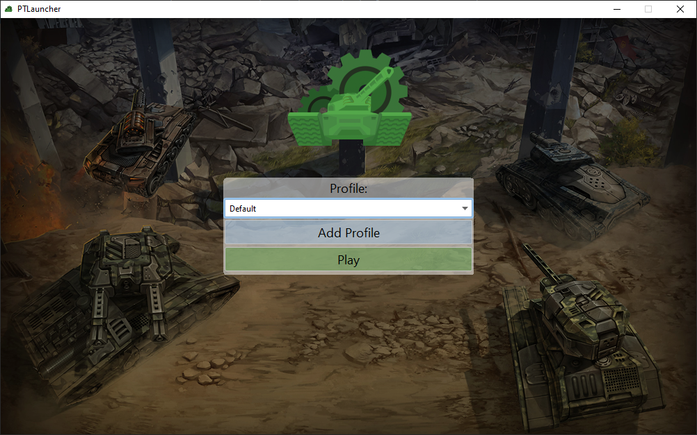

# PTLauncher

Custom GUI launcher for ProTanki

The idea of this launcher was inspired by [this launcher](https://github.com/protanki-re/client-launcher).
Launcher comes with AIR (Windows only) and slightly modified [client-chainloader](https://github.com/protanki-re/client-chainloader). <br>
This launcher will only be useful for you if you are playing on custom server, otherwise you would probably use the official launcher.

Custom servers:
 - https://github.com/DaniloPalmeira/protanki-server
 - https://github.com/WolverinDEV/protanki-protocol-rs (This one is not a server, but still may be useful)

### Quick start
```shell
git clone https://github.com/TheEntropyShard/PTLauncher.git
cd PTLauncher
mvn clean compile assembly:single
java -jar target/ptlauncher-1.0-jar-with-dependencies.jar
```



The UI sucks, I know